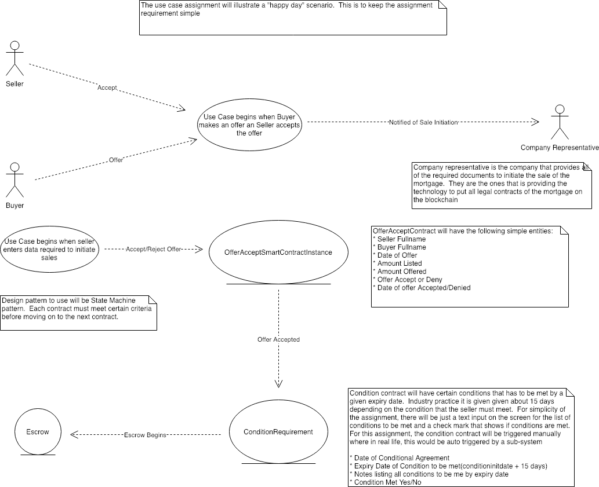

# Comfree Property

Comfree Property is a set of smart contracts protocol that is required for selling a property.  It is working within the laws of real state laws for each Canadian Province and U.S State.  All contracts contain all tradition elements of a real state transaction.  Each contract is initiated when a dependent contract meets a certain state of the contract.  For example, the offerContract is the initial start of a real state transaction.  The buyer will make an offer that is recorded in the OfferContract.  Once the offerContract is at a state of "offer accepted", the SaleCondition contract will be initiated.  The flow of this logic is controlled on the application layer.  Comfree protocol is a layer to transaction but logic and business flow will dictate when each contract is instantiated.  This design will allow any real estate company to use the "comfree property" platform in anyway while the owner of these contract, the developers, will get a share of each transaction which is why the payment between buyer and seller from escrow contract goes through the default coinbase.  But the architecture of the core contracts are/should be flexible enough to be used in both commercial and private property sales.

## Install
.....
run localhost
.....

## Development 
$ git clone https://github.com/jaypersanchez/comfreeproperty

## Usecase Diagram

## Usage from Truffle Console
1. Create OfferContract instance - OfferContract.deployed().then(function(instance){offerInstance=instance;})
2. Set seller address using one of the account from Ganache: offerInstance.setSellerAddress('walletaddress')
3. Set buyer address using one of the account from Ganache: offerInstance.setBuyerAddress('walletAddress')
4. Accept offer: offerInstance.accept(true)
5. Verify offer is accepted: offerInstance.isOfferAccepted.call()
6. Create SaleConditionContract instance.  
7. Set condition list to true/false.  Invoke SaleCondition.isConditionMet; if all conditions from ConditionList are true, next state of contract will be allowed

## Future to-do Improvement List
1. Set validation when setting buyer and seller address.  Make sure that buyer address is not set to seller address once seller address has     been set
2. Fix date stamp in OfferContract for expiration
3. Change design/implementation so that SaleConditionContract will allow itself to be created
when OffectContract is at accepted state
4. Should add change when moving from one state to another, from OfferContract to SaleConditionContract for example, both public keys of seller and buyer must be provided as a way to authenticate consent of state change
5. Add contracts for tenancy/rental contracts
6. Shyft Network or uPort for KYC/AML
7. Application UI for user application example
8. During development, ether is used as currency for the buy/sell transaction.  Implement MetaCoin as a utility 
token as currency for buy/sell transaction

